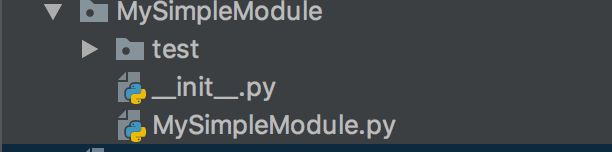
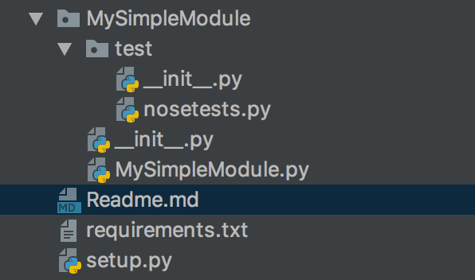
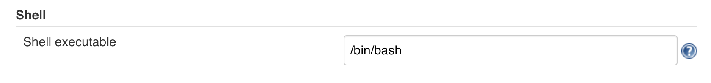
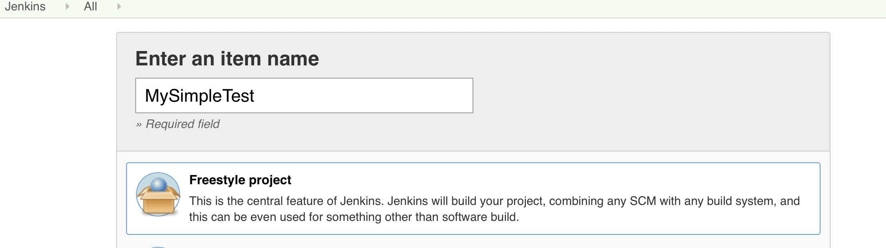
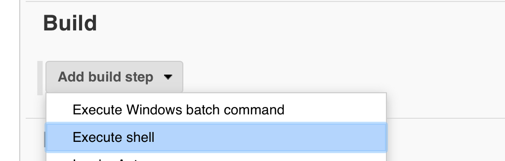
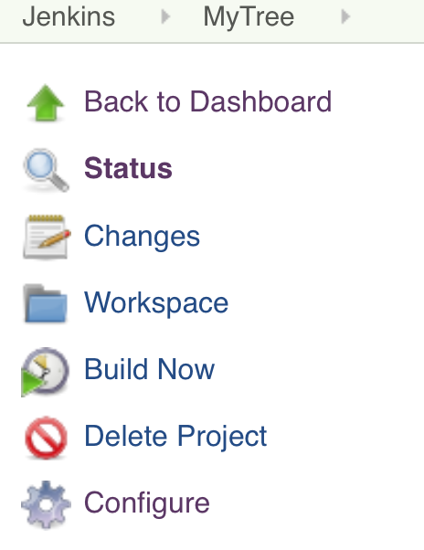
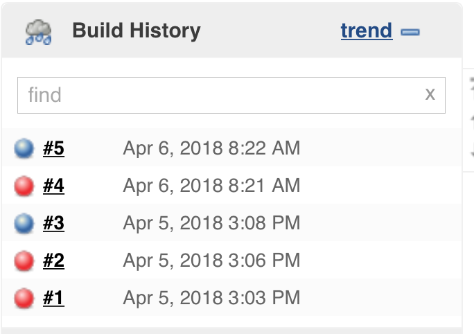
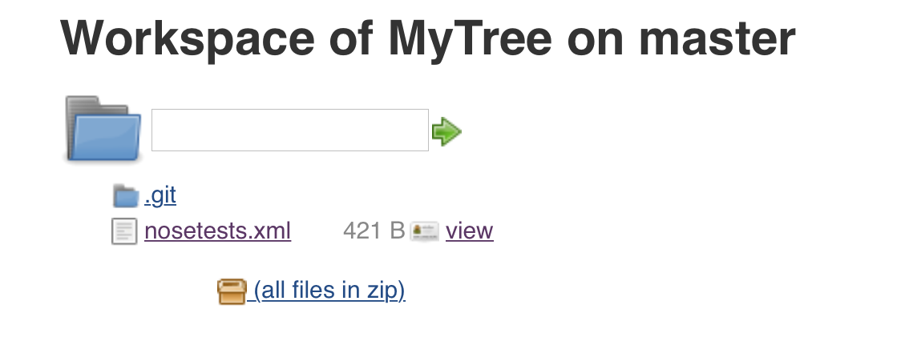
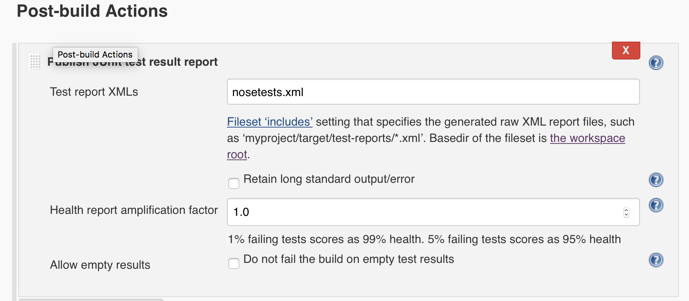

# Jenkins and Python Intergration

I have been tasked to look into using Jenkins as a platform for CI (Continious Intergration), with specific reference to Python, although this in time will also be expanded to ad C and C++.

There are several instalation tutorials on the Net showing you how to install Jenkins, but non really give a details way of explaining how a beginner goes about in using Jenkins.

This is my objective here - to try and show you how to use Jenkins.


# The Module

I am going to be using a really really simple Module, so we do not focus on Python code complexity.

This is the Module - called **MySimpleModule** which I am going to be performing my CI walkthrough on.

```python
class MySimpleModule(object):

    def __init__(self):
        self.dummy_data=[1,2,3]

    def isInData(self,n):
        """
        Is the supplied number in the self.data list
        :param n:
        :return: True or False
        """
        try:
            if n in self.dummy_data:
                return True
            else:
                return False
        except Exception as err:
            raise ValueError
```

I have a simple Module **__init__.py** like this

```python
from .MySimpleModule import MySimpleModule
```

And the whole module looks like this



I create a **setup.py** which looks like this

```python
from setuptools import setup

setup(
    name='MySimpleModule',
    version='V0.01',
    packages=['MySimpleModule', 'MySimpleModule.test'],
    url='',
    license='',
    author='tim seed',
    author_email='tim@syedm.com',
    description='Test Module for Learning Jenkins'
)
```

I also createed a **requirements.txt** file which looks like this.

```text
nose
coverage
```

## Test 

In case you thought I was done, I created a **test** directory, and inside it I wrote my **extensive** (laughing), test modules.

Which look like this

```python

from MySimpleModule import MySimpleModule

cls=None

def test_000_init():
    global cls
    cls=MySimpleModule()
    assert cls


def test_010_isin_good():
    global cls
    assert cls.isInData(1) == True


def test_020_isin_bad():
    global cls
    assert cls.isInData(99) == False


```


The whole project structure now looks like this 




# Jenkins Time 

I have installed Jenkins on my local machine (a Mac), and have logged in.


## Shell Setup
The first thing I alter is the default shell. I want to use **bash**. This only needs to be done 1 time.

  - Jenkins
    - Manage Jenkins
      - Configure System
      
      Scroll down and find the *Shell* area and set it like this
      
      


## New Item

We return to the Jenkins Home, and select **New Item**

We enter an Item name and click **Freestyle Project**.

Like this



At the bottom of the page - clock **OK**.

## Build Steps

I now scroll down the Item configuration and stop at the bottom of the Page, 




Inside the text area I write the following commands

```bash

PROJECT="MySimpleModule"


rm -Rf ~/Builds/$PROJECT
CODE_HOME=~/Builds/$PROJECT/code
PYENV_HOME=~/Builds/$PROJECT/python
export PYENV_HOME

echo "Creating new Python env"
/usr/local/bin/virtualenv  $PYENV_HOME
source $PYENV_HOME/bin/activate

echo "Get Project"
mkdir -p $CODE_HOME
cd $CODE_HOME
pip install --upgrade pip

git clone https://github.com/timseed/MySimpleModule msm
cd msm
pip install -r requirements.txt
python setup.py install
```

Then I press **Save**.

### Understanding the steps

Firstly understand this *job* runs as a user called Jenkins - unless you have setup a new user account.

So we

  - Set a Project Title
  - Remove Al the Project Tree
  - Create Python Env in Project/python
  - Git clone my Source Repo 
  - pip install requirements
  - pip install MySimpleModule
  
You should be able to do these steps and verify outside of Jenkins.
    

## Running the build

Just click on the **Build Now** text.



If everything worked well ... you will see a Blue Circle, problems/failures will result in a Red Circle.





## Is that it ?

Maybe yes, maybe no.

What have we proved ?

  - Simply that a user with an Empty Python Environent can install this awesome module.

What have we not proved ?
  
  - The tests run as expected
  - a known percentage of the module is subject to code-coverage
  
We will try and address each issue individually.

### The tests run as expected

As we installed  **nose** in a valid python env, we should be able to run

```bash
(python) bash-3.2$ nosetests MySimpleModule\test\nosetests.py 
```
The output should be like this 

```text
...
----------------------------------------------------------------------
Ran 3 tests in 0.001s

OK
```

To see a little more info add --verbose

```
 bash-3.2$ nosetests nosetests.py --verbose
```

Now produces

```text 
MySimpleModule.test.nosetests.test_000_init ... ok
MySimpleModule.test.nosetests.test_010_isin_good ... ok
MySimpleModule.test.nosetests.test_020_isin_bad ... ok

----------------------------------------------------------------------
Ran 3 tests in 0.001s

OK
```

This alas in not in *Jenkins* format ... but this output is

```bash
 nosetests --with-xunit --all-modules     \
    --traverse-namespace --with-coverage  \
    --cover-inclusive MySimpleModule/test/nosetests.py 
```

I see the output of 

```text
...
Name                               Stmts   Miss  Cover
------------------------------------------------------
MySimpleModule/MySimpleModule.py      10      2    80%
MySimpleModule/__init__.py             1      0   100%
------------------------------------------------------
TOTAL                                 11      2    82%
----------------------------------------------------------------------
Ran 3 tests in 0.002s

OK

```

Also note that this nosetest produces a file called **nosetests.xml** 

#### Jenkins nosetest

As Jenkins is run in a slightly different environment I modify the command to be

```bash
nosetests --with-xunit --all-modules \
          --traverse-namespace --with-coverage \
          $PROJECT/test/nosetests.py \
          --cover-inclusive \
          --xunit-file=$WORKSPACE/nosetests.xml
```

Please note: WORKSPACE is only available from withing Jenkins

When the build runs (assuming it all works) ... you can click on Workspace

and you should see something like



We now need to use this xml output.

#### Post Build Step

We now need to add a post build step.




We re-build the project (assuming it still passes), we now can 

I think we have resolved the *does it test* issue.

## Code Coverage

The coverage command should be used like this

```bash
coverage run file_or_module
coverage xml file_or_module or coverage xml -o /tmp/coverage.xml
```

This will place a file called coverage.xml in the local folder.


